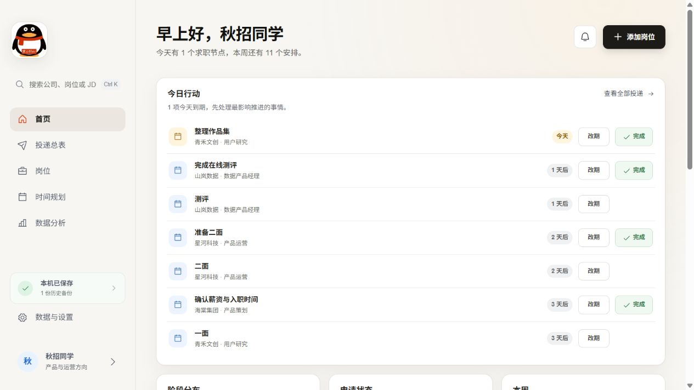
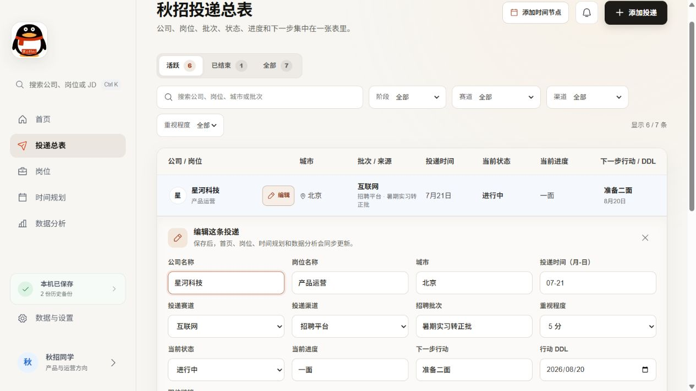
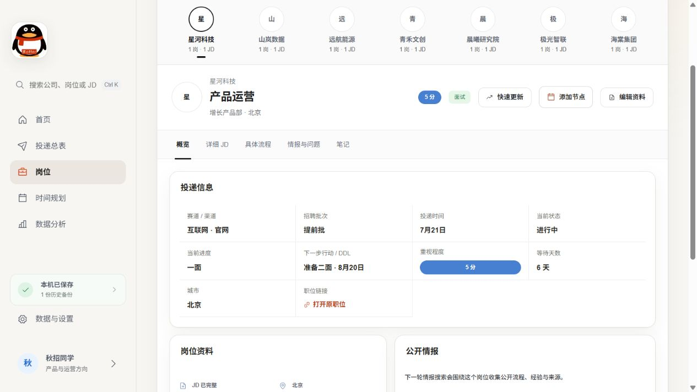
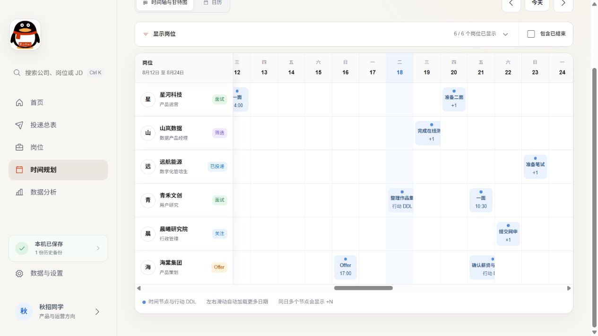
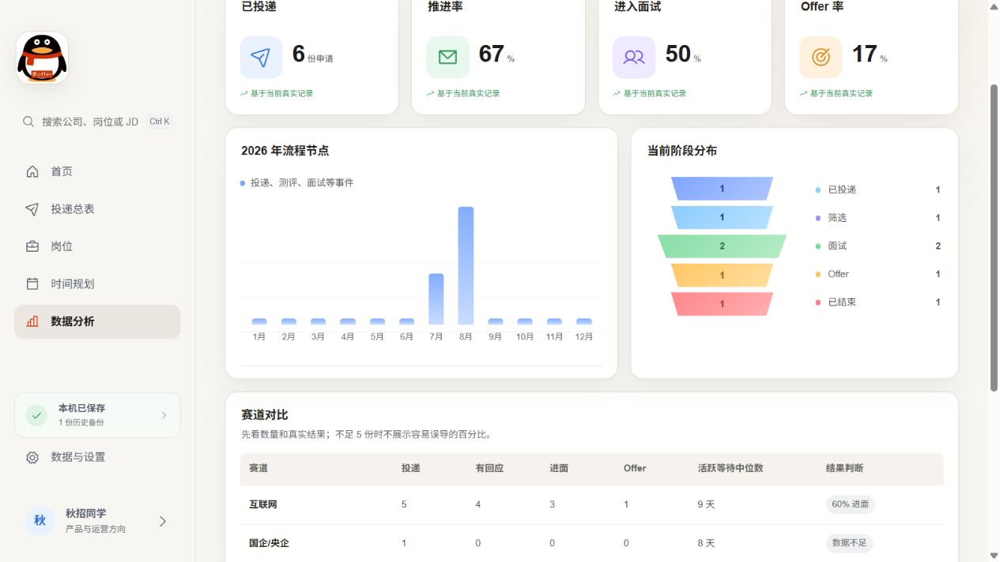

<p align="center">
  
</p>

<h1 align="center">求 offer</h1>

<p align="center">
  面向个人秋招的 Windows 本地工作台。集中管理投递、招聘流程、行动 DDL、JD、面试复盘和分析，所有个人数据只保存在自己的电脑里。
</p>

> 这是基于用户指定的 [differance-dfhs/up](https://github.com/differance-dfhs/up) 改造的 Windows 本地版本。当前程序名、快捷方式和本地存储标识统一为 `offer`。



截图使用虚构演示数据，不包含真实公司、岗位或个人信息。

## 它解决什么问题

秋招信息通常散落在招聘网站、聊天记录、日历和笔记里。`求 offer` 把这些信息收进一套连续流程：

1. **记录投递**：保存公司、岗位、城市、批次、渠道、职位链接和重视程度。
2. **更新进展**：分别维护当前状态与当前进度，保留用户对事实的最终判断。
3. **安排下一步**：记录测评、面试等时间节点，并为跟进事项设置 DDL。
4. **集中复盘**：在岗位详情查看 JD、备注、面试复盘和完整流程。
5. **调整策略**：通过阶段分布、赛道结果和等待天数判断精力应该放在哪里。

它是个人本地工具，不会自动投递，不需要账号，也不依赖云数据库。

## 一次更新，相关页面自动同步

| 更新内容 | 自动同步到 |
| --- | --- |
| 公司、岗位、城市、批次、渠道 | 投递总表、岗位详情和筛选结果 |
| 投递时间 | 岗位时间线、甘特图、日历和数据分析 |
| 当前状态、当前进度 | 首页阶段、投递总表、岗位详情和分析 |
| 下一步行动、行动 DDL | 首页行动中心、时间规划和日历 |
| 重视程度、赛道、渠道 | 重点岗位、筛选和赛道分析 |
| JD、截图、备注、面试复盘 | 对应岗位的完整资料 |

## 主要界面

### 投递总表

把公司、岗位、城市、赛道、渠道、批次、投递时间、状态、进度、下一步和职位链接放在一张表里。每行都可以直接展开编辑，保存后自动更新其他页面。



### 岗位详情

按公司浏览岗位，在一个页面查看投递信息、JD、公开情报、笔记、时间节点和面试复盘。状态与进度分开保存，时间线只提供可确认的推进建议，不会静默覆盖手填内容。



### 时间规划

甘特图和日历共用同一份时间线。投递、测评、面试、Offer 与行动 DDL 会按日期出现；默认聚焦活跃岗位，也可以查看已结束岗位的历史。



### 数据分析

根据已经发生的真实节点统计投递、推进、面试和 Offer，不把未来计划提前算成结果。赛道样本过少时只展示数量，避免用不可靠的百分比误导判断。



## 核心能力

- 今日行动中心：优先显示逾期、今天到期和近期要处理的事项。
- 投递总表：支持生命周期、阶段、赛道、渠道和一至五分重视程度筛选。
- 直接编辑：在总表中修改核心信息，无需反复进入多个页面。
- 多入口时间线：首页、投递总表、岗位页和时间规划都能添加节点。
- 面试复盘：面试节点可记录问题、回答、薄弱点和下次改进。
- 大量投递展示：总表分页、岗位目录折叠、甘特图分组、日历同日事项展开。
- 本地可靠性：自动保存、历史快照、恢复入口、删除撤销和多标签冲突保护。
- 材料归档：保存 JD 文字、JD 截图、职位链接、备注和岗位文件。

## Windows 安装

### 环境要求

- Windows 10 或 Windows 11
- [Node.js](https://nodejs.org/) 20 LTS 或更新版本
- npm，安装 Node.js 时会一并提供

### 方式一：下载代码

在 GitHub 页面选择 **Code → Download ZIP**，解压到一个长期保留的目录，然后在该目录打开 PowerShell。

### 方式二：使用 Git

```powershell
git clone https://github.com/Sakura7596/offer.git
cd offer
```

### 安装依赖并创建桌面入口

```powershell
npm install
powershell -NoProfile -ExecutionPolicy Bypass -File .\scripts\install-windows-shortcut.ps1
```

安装完成后，桌面会出现 **求offer** 快捷方式。双击后会在本机启动服务，并用默认浏览器打开：

```text
http://127.0.0.1:4173/
```

不要随意移动安装目录，因为桌面快捷方式会从该目录启动程序。需要移动时，在新目录重新运行安装脚本即可。

## 第一次使用

1. 打开桌面的 **求offer**。
2. 点击右上角“添加岗位”，先记录公司、岗位、赛道、渠道、职位链接和重视程度。
3. 已经投递时填写投递时间；未来准备投递时，该日期会先作为计划进入时间线。
4. 收到测评或面试后，在首页、岗位页或时间规划中添加时间节点。
5. 为每个活跃岗位设置下一步行动和 DDL，首页会自动整理当天最值得处理的事项。
6. 定期查看数据分析，并从“数据与设置”导出一份便携备份。

## 数据保存与隐私

个人工作区默认保存在：

```text
%LOCALAPPDATA%\Offer-AutumnRecruitment\data
```

- 页面服务只绑定 `127.0.0.1`，不会主动向局域网公开。
- 仓库只包含空白数据模板，真实公司、岗位、JD、截图和笔记不会进入 Git。
- 每次保存都会生成本机历史快照，可在“数据与设置”中查看和恢复。
- 重新构建、更新代码或重新创建快捷方式，不会覆盖 LocalAppData 中的工作区。
- 便携导出由用户主动触发，导出的文件保存在哪里由用户自己决定。

## 更新项目

如果通过 Git 克隆：

```powershell
git pull
npm install
powershell -NoProfile -ExecutionPolicy Bypass -File .\scripts\install-windows-shortcut.ps1
```

安装脚本会重新构建页面并更新桌面快捷方式，原有个人数据继续保留。

## 开发与验证

```powershell
npm install
npm test
npm run build
npm run app:start
```

开发时如需测试写入，请设置独立的 `OFFER_DEV_DATA_DIR`，不要对日常使用的数据目录执行测试。

主要目录：

```text
src/        React 页面、样式和业务模型
scripts/    Windows 启动、快捷方式与本地数据服务
tests/      业务语义和数据存储回归测试
docs/       使用说明、演示截图与优化计划
data/       公开仓库中的空白模板
```

## 可选的 Codex Loop

项目保留了可选的情报整理流程。需要时复制 [docs/codex-loop-prompt.md](docs/codex-loop-prompt.md)，并将 `{{OFFER_DATA_DIR}}` 替换为自己的本机数据目录。它只应写入带来源的公开情报，不应改写用户确认的投递状态和进度。
